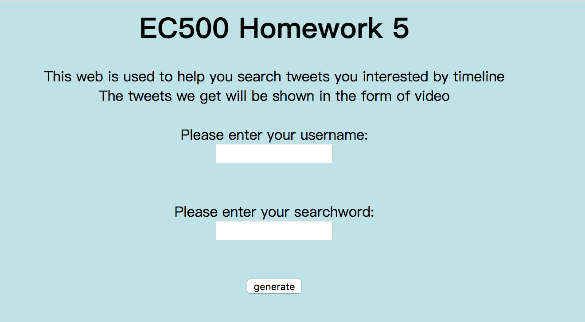

## twitter-summarizer-rest-service  
* Set up AWS EC2  
* Run rest.py in EC2:  
  
* Open url ec2-18-223-169-200.us-east-2.compute.amazonaws.com:8240
  
* Enter the foldername and searching keyword
* Click generate and you will get the zip containing video of ten tweets.
